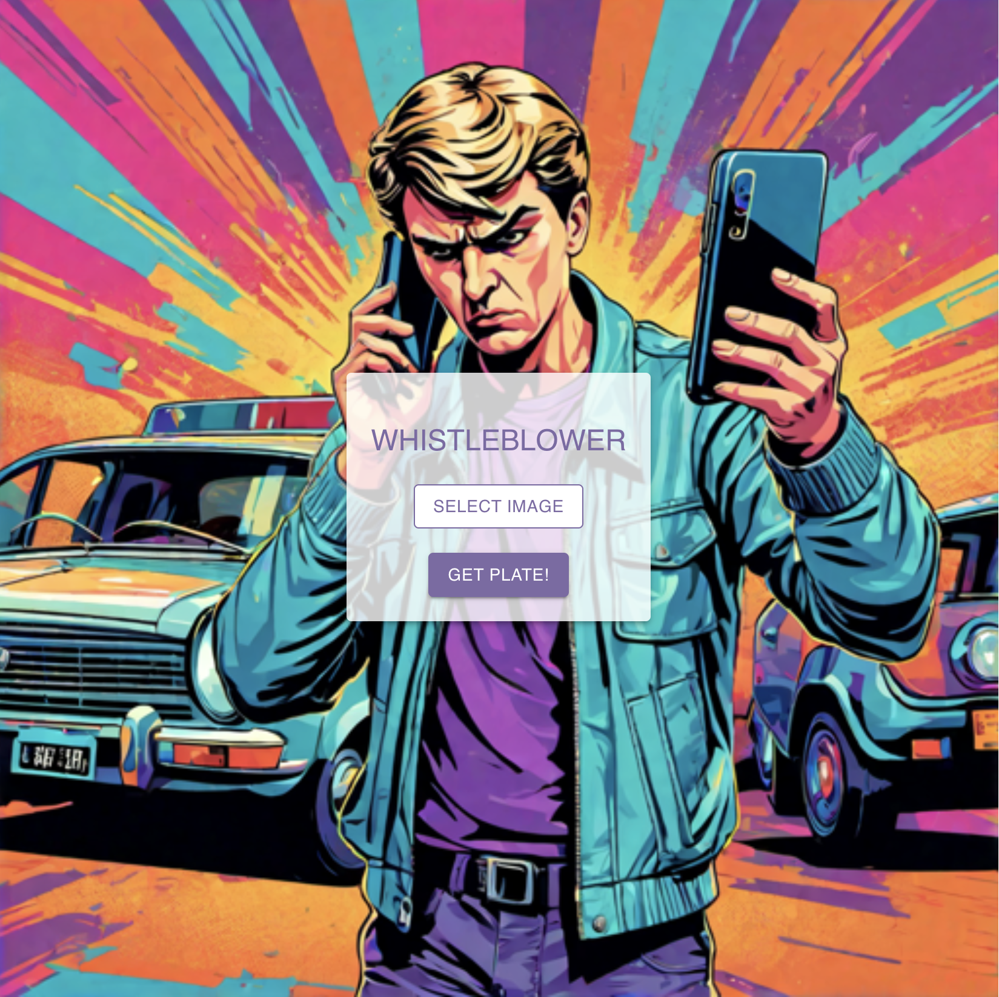

# Whistleblower Dapp

The application consists of a chain-verifiable image recognition system using AI algorithms. The system can operate within the Cartesi Machine and identify license plates of vehicles involved in legal violations. The collected data, including images and license plate information, will be securely stored on the blockchain to provide irrefutable evidence of traffic violations.

The main goal of our project is to improve traffic safety by automating license plate detection and traffic violation identification using blockchain and AI technology.

## Interacting with the application

If you want to report a violation using the whistleblower application, follow these steps:

1. Take a photo of the violating vehicle using your mobile phone.
2. Go to the website **www.whistleblower.com** to access the application.
3. Use the "SELECT IMAGE" button to choose the photo of the vehicle you want to report.
4. Click on the "GET PLATE!" button to send the image for processing.

Following these steps, the image is sent to the cartesi machine, where artificial intelligence models are used to detect the position of the license plate and extract the characters it contains.
Once the request is processed, the cropped license plate image and the corresponding text of the characters found are returned to the user via the app.

Documentation for developers available [here](./docs/index.md)
